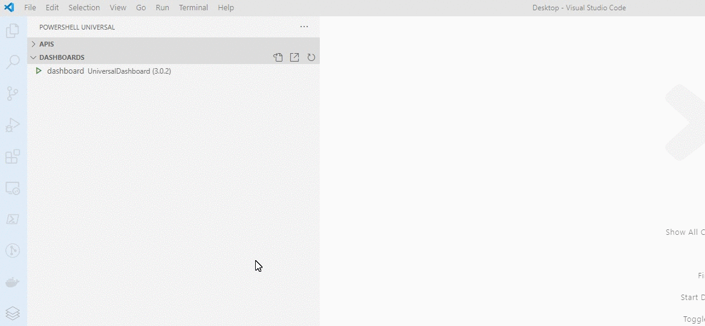

# Development

## Developing a Dashboard with VS Code

The [Visual Studio Code extension for PowerShell Universal](https://marketplace.visualstudio.com/items?itemName=ironmansoftware.powershell-universal) provides integration for working with dashboards. We recommend you also install the [PowerShell extension](https://marketplace.visualstudio.com/items?itemName=ms-vscode.PowerShell).

To add a new dashboard, visit the admin console and go to Dashboard  Dashboards and click the Add Dashboard button.


After adding the dashboard, a dashboard PS1 file will be created and the `dashboards.ps1` file will be updated. You can view your dashboard in VS Code underneath the dashboards tree view. It will show the current state of the dashboard and the framework it is using.


If you want to edit your dashboard, click the Open Dashboard File button. This will open the dashboard PS1 file in the editor and import the Universal module and Dashboard framework module so you have IntelliSense.


From here, you can begin editing your dashboard.


Your dashboard should restart automatically when you make changes. You will be able to view the dashboard in the browser by clicking the View button.


If you need to restart your dashboard manually, you can click the Restart button.


## Developing a Dashboard with Single-File Configuration

You can use the Universal Dashboard PowerShell module and single-file configuration to build a dashboard directly from PowerShell.

Install the Universal Dashboard PowerShell Module. This will install both the Universal Dashboard framework module and the PowerShell Universal module.

```text
Install-Module UniversalDashboard
```

Install the latest version of the Universal server.

```text
Install-PSUServer -LatestVersion
```

Create a PS1 file for your configuration data and start the server.

```text
Start-PSUServer -Port 8080 -Configuration {
    New-PSUDashboard -Name 'Dashboard' -BaseUrl '/dashboard' -Framework 'UniversalDashboard:Latest' -Content {
        New-UDDashboard -Title 'Hello, World' -Content {
            New-UDForm -Content {
                New-UDTextbox -Label 'Say Hi' -Id 'textbox'
            } -OnSubmit {
                Show-UDToast -Message $EventData.textbox
            }
        }
    }
}
```

Navigate to your dashboard.

```text
Start-Process http://localhost:8080/dashboard
```

Changes you make to your PS1 file will cause Universal to automatically reload your dashboard and reflect the changes.

## Debugging a Dashboard

### Logs

You can view the dashboard logs by right clicking on the Dashboard and clicking View Log. The log should provide information about start up issues or errors when executing sections of your dashboard.



### Debugger


This section requires the PowerShell extension.


You can debug individual endpoints within your dashboard by using `Wait-Debugger`

For example, if I wanted to debug the button on my dashboard, I would add it to the `OnClick` event handler.

```text
New-UDDashboard -Title "Hello, World!" -Content {
    New-UDTypography -Text "Hello, World!"

    New-UDButton -Text "Learn more about Universal Dashboard" -OnClick {
        Wait-Debugger
        Invoke-UDRedirect https://docs.ironmansoftware.com
    }
}
```

Now, I can right click on my dashboard and click Debug Dashboard Process.


This will issue an `Enter-PSHostProcess` command in the Integrated Terminal.

```text
PS C:\Users\adamr\Desktop> Enter-PSHostProcess -Id 15464

[Process:15464]: PS C:\Users\adamr\Documents>
```

Next, you'll want to navigate to your page and click the button. Once the button is clicked, issue a `Get-Runspace` command in the Integrated Terminal. You'll notice that one of the runspaces is in `InBreakpoint` availability.

```text
[Process:15464]: PS C:\Users\adamr\Documents> Get-Runspace


 Id Name            ComputerName    Type          State         Availability
 -- ----            ------------    ----          -----         ------------
  1 Runspace1       localhost       Local         Opened        Busy        
  2 Runspace2       localhost       Local         Opened        Available   
  3 RemoteHost      localhost       Local         Opened        Available   
  4 e8be011f-40f8-… localhost       Local         Opened        InBreakpoint
```

Finally, issue the `Debug-Runspace` command and VS Code will automatically open your endpoint in the debugger. You'll be able to step through your code, view variables and issue commands against the runspace.


### Debug-PSUDashboard

`Debug-PSUDashboard` can be used instead of `Wait-Debugger` to more easily debug aspects of your dashboard. `Debug-PSUDashboard` requires the PowerShell Universal VS Code extension. When placed within a dashboard, this cmdlet will trigger a modal to be show with some information about connecting to the runspace that is currently running the code you are trying to debug.


You can enter the commands listed in any PowerShell host to connect to the runspace that is currently running in the dashboard.

If you have VS Code and the PowerShell Universal extension installed, you can use the Debug with VS Code button to automatically launch VS Code and connect to the runspace. You can see how that works by watching this video.



