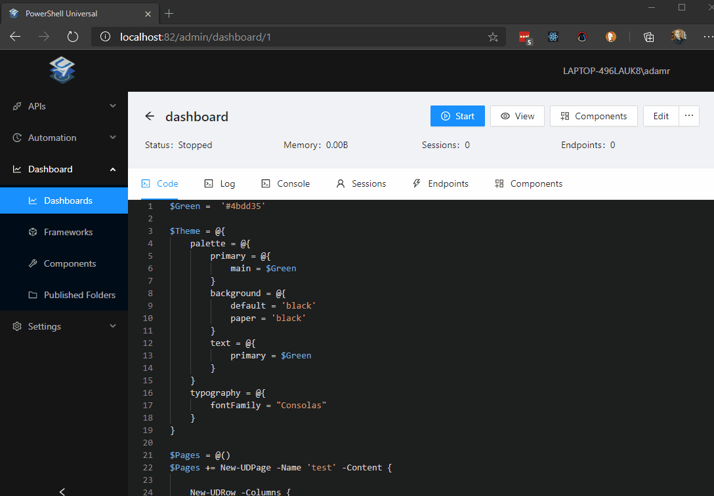

# Components

A Universal Dashboard website is composed of components. There are two frameworks that provide a set of core components that you can use within your pages. In addition to the core component, you can also extend Universal Dashboard with a large set of community created components.

There are two non-framework components that are built in to PSU. These include the Nivo charts library as well as the UDMap component. They will work in either framework. Additional components can be downloaded from the [UD Marketplace](https://marketplace.universaldashboard.io/).

External components are distributed as PowerShell modules and can be used in a dashboard by using `Import-Module`.

When building a dashboard, you can simply call the PowerShell cmdlets within your dashboard script to create a new component.

```text
New-UDDashboard -Title 'Dashboard' -Content {
    New-UDTypography -Text 'Hello, world!'
}
```

## Adding Components to Dashboards

Some components are not included automatically. You can add component modules by clicking the Components button on the Dashboard page and then adding the components. This list will also include components downloaded from the Marketplace.



## Component Storage

Each version of PowerShell Universal includes some built in components. These components are included in the local installation directory. During start up, they are deployed to the assets folder. By default, this folder is `%ProgramData%\PowerShellUniversal\Dashboard\Components` . 

You can change the assets folder by updating appsettings.json. 

```text
  "UniversalDashboard": {
    "AssetsFolder": "%ProgramData%\\PowerShellUniversal\\Dashboard",
  },
```

### Manual Component Installation

You can manually install components into the assets folder by including the appropriate folder structure and files. All components need to be valid PowerShell modules. 

Each component should be in a folder with the module name and an additional folder with the version. 


### Including Components in the Repository

You can also include components within the code Repository. By including them in the repository, they will be downloaded when using [git sync](../../../config/git.md). This functionality is only enabled when git sync is enabled. 

After a git pull is performed on the remote repository, Components will be automatically loaded and available within the Components page within PowerShell Universal. The structure and layout of the components folder is the same as the main assets folder. 


